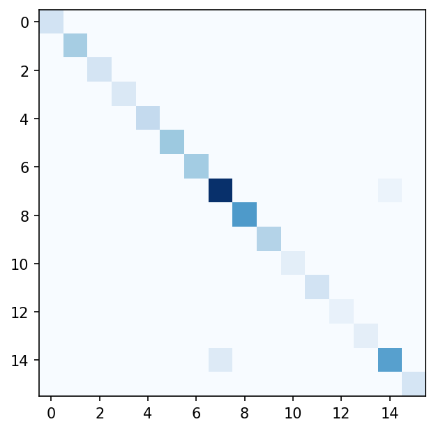
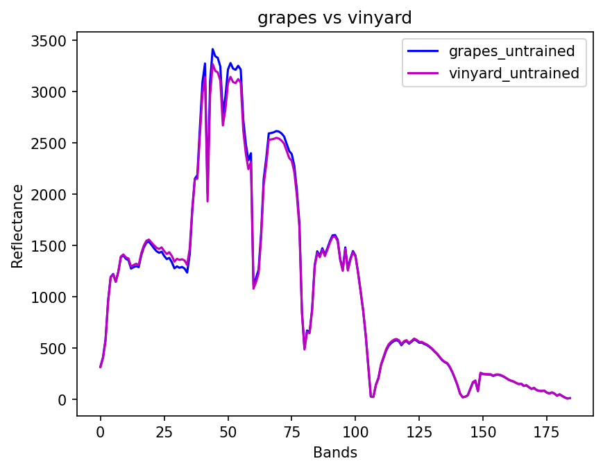
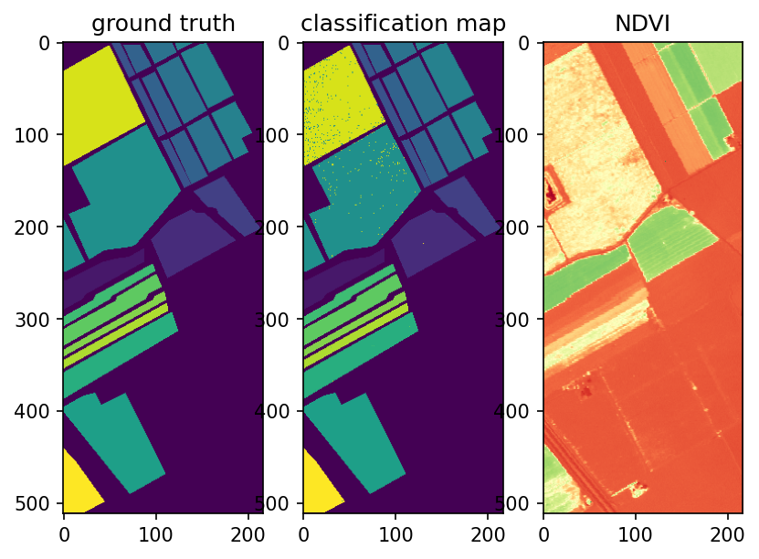
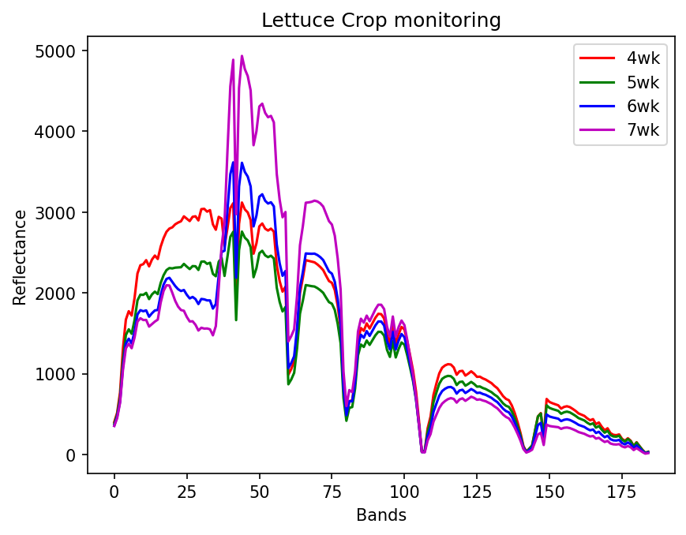

## Project - Hyperspectral Crop Analysis: Classification and Health Monitoring of Salinas Valley.

The **WHAT** - AVIRIS atmospherically corrected hyperspectral data and ground truth labels of salinas valley, the *project* examines health of crops and plots the spectral signatures. 
Project finds 3 key results in total with RESULT I,II,III. which are 
1. Misclassification of two classes of crops (grapes and vinyard) 
2. NDVI and classification maps which tells us Which crops has less vegetation or bare soil.
3. Lettuce 4 classes (4,5,6,7 week) spectral signatures. In which there is one anomaly with week 5 class of Lettuce.

#### RESULTS 

**RESULT I**

1. Class 8 (grapes_untrained) and Class 15 (vinyard_untrained) misclassification.

**RESULT II**

2. Ground Truth, Classification Map and NDVI Plot

**RESULT III**

3. Lettuce Spectral Signatures

The **WHY** - Hyperspectral captures subtle changes in the environment which normal RGB and Multispectral can't do. Which can be used by farmers or insurance companies to detect early health concern of crops. As farmers can't do regular ground checkup on crops if the field is spread over several acres. So knowing NDVI and full classification data farmer can inspect those areas only where vegetation got compromised. 

## How to Run
1. Install dependencies: `pip install -r requirements.txt`
2. Download Salinas_corrected.mat and Salinas_gt.mat from http://www.ehu.eus/ccwintco/index.php/Hyperspectral_Remote_Sensing_Scenes
3. Open `main.ipynb` and run all cells

## Files
- `main.ipynb` — clean final pipeline with analysis and results
- `outputs` - 4 png files of RESULTS I,II,III

## Data Source
AVIRIS Salinas Valley Hyperspectral Dataset — http://www.ehu.eus/ccwintco/index.php/Hyperspectral_Remote_Sensing_Scenes